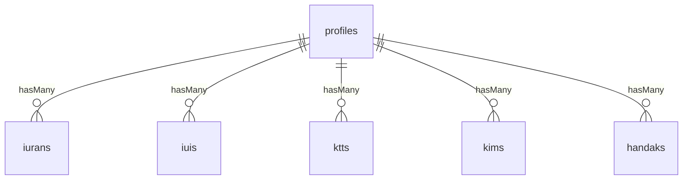
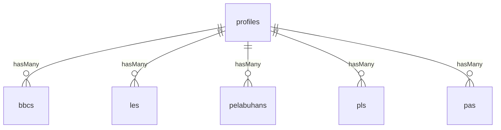
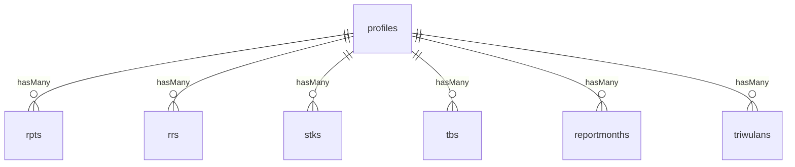
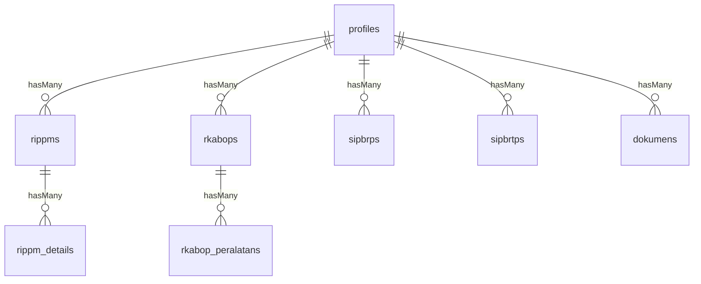

# Gambaran Proyek

-   **Tujuan**: MinersDB menghimpun data profil perusahaan tambang beserta perizinan, kepatuhan, dan dokumen pendukung untuk Bidang Pertambangan DESDM Kalimantan Tengah, lengkap dengan navigasi dan branding khusus `resources/views/components/layouts/app.blade.php:51-309` `resources/views/login.blade.php:1-175`.
-   **Tumpukan Teknologi**: PHP 8.2/Laravel 12, Livewire 3.6, dan Maatwebsite/Excel pada sisi server. Frontend memanfaatkan Vite/Tailwind CSS, Bootstrap, Alpine.js, serta bundel aset Laravel `composer.json:8-59` `package.json:5-16` `resources/css/app.css:1-10` `resources/js/app.js:1`.
-   **Ringkasan Arsitektur**: Aplikasi monolitik yang memetakan setiap rute ke kelas Livewire. Komponen beroperasi langsung dengan model Eloquent dan berbagi trait unggahan dokumen. Fitur ekspor melakukan eager loading relasi dinamis. Status (ID perusahaan terpilih, token API) disimpan di session/cookie dan diawasi middleware `routes/web.php:37-81` `app/Livewire/DaftarPerusahaan.php:11-88` `app/Livewire/Profile/Profile.php:8-149` `app/Traits/WithDokumen.php:11-95` `app/Exports/ProfilesExport.php:11-181`.

# Struktur Folder

-   `app/Http/Controllers`: Otentikasi eksternal (`AuthApiController`) dan controller tampilan ekspor `app/Http/Controllers/AuthApiController.php:10-75`.
-   `app/Livewire`: Komponen halaman (daftar perusahaan, profil, perizinan, pelaporan, ekspor, cetak) dengan aturan validasi dan logika CRUD sendiri `app/Livewire/DaftarPerusahaan.php:11-88` `app/Livewire/Profile/Profile.php:8-149`.
-   `app/Models`: Model Eloquent tipis yang mendefinisikan kolom/relasi, termasuk helper `latest*` untuk ekspor `app/Models/Profile.php:9-245`.
-   `app/Traits`: `WithDokumen` menyatukan validasi unggahan, penyimpanan, unduh, hapus, serta penanganan pagination `app/Traits/WithDokumen.php:11-95`.
-   `app/Exports`: `ProfilesExport` menyusun daftar kolom dinamis, eager load relasi bertingkat, dan mengatur heading/format Excel `app/Exports/ProfilesExport.php:11-181`.
-   `routes/web.php`: Satu-satunya daftar rute; seluruh rute mengarah pada Livewire atau controller dengan middleware tertentu `routes/web.php:37-81`.
-   `resources/views/components/layouts`: Layout utama (`app.blade.php`) dan layout cetak sederhana `resources/views/components/layouts/app.blade.php:1-309`.
-   `resources/views/livewire`: Template Blade untuk setiap komponen Livewire, termasuk pagination kustom `resources/views/livewire/daftar-perusahaan.blade.php:1-160` `resources/views/custom-pagination.blade.php:1-84`.
-   `database/migrations`: Skema untuk tabel inti, tabel kepatuhan (RKAB, RIPPM, SIPB, dsb.), dokumen, serta tabel bawaan Laravel `database/migrations/2025_06_30_151406_create_profiles_table.php:12-43`.
-   `database/seeders`: Seeder untuk profil dan seluruh modul kepatuhan `database/seeders/DatabaseSeeder.php:46-68`.
-   `config/livewire.php`: Konfigurasi layout default, batas unggahan (hingga 150 MB untuk pelaporan), dan opsi SPA `config/livewire.php:41-146`.

# Dokumentasi Routing

Semua rute berada di `routes/web.php:37-81`. Tidak ada API terpisah.

| Metode & Path               | Handler                           | Deskripsi                                                  |
| --------------------------- | --------------------------------- | ---------------------------------------------------------- |
| GET `/`                     | Redirect                          | Mengarahkan ke `/home`.                                    |
| GET `/profiles/view`        | `App\Livewire\ExportProfiles`     | UI pemilihan kolom & perusahaan untuk ekspor.              |
| GET `/profiles/export`      | Blade `exports.profiles`          | Membungkus komponen ekspor Livewire.                       |
| GET `/login`                | `AuthApiController@showLoginForm` | Form login bermerek.                                       |
| POST `/login`               | `AuthApiController@login`         | Menyampaikan kredensial ke API miners dan menyimpan token. |
| POST `/logout`              | `AuthApiController@logout`        | Menghapus session & cookie, siap memanggil logout API.     |
| GET `/home`                 | `DaftarPerusahaan`                | Daftar perusahaan + filter Livewire (hanya `CekApiAuth`).  |
| GET `/profile/{id}/cetak`   | `CetakProfil`                     | Layout cetak (saat ini placeholder statis).                |
| GET `/profile/create`       | `ProfileAdd`                      | Form penambahan profil perusahaan.                         |
| GET `/profile/{id}`         | `Profile`                         | Detail profil dengan edit inline.                          |
| GET `/iuran`                | `Profile\Iuran`                   | Iuran tetap tahunan + dokumen.                             |
| GET `/iui`                  | `Profile\Iui`                     | Riwayat IUI.                                               |
| GET `/ktt`                  | `Profile\Ktt`                     | Data Kepala Teknik Tambang.                                |
| GET `/kim`                  | `Profile\Kim`                     | Perizinan KIM.                                             |
| GET `/handak`               | `Profile\Handak`                  | Gudang bahan peledak.                                      |
| GET `/bbc`                  | `Profile\Bbc`                     | Tangki BBC.                                                |
| GET `/le`                   | `Profile\Le`                      | Laporan eksplorasi.                                        |
| GET `/pelabuhan`            | `Profile\Pelabuhan`               | Persetujuan pelabuhan.                                     |
| GET `/pl`                   | `Profile\Pl`                      | Persetujuan lingkungan.                                    |
| GET `/pa`                   | `Profile\Pa`                      | Project area.                                              |
| GET `/rpt`                  | `Profile\Rpt`                     | Rencana pascatambang.                                      |
| GET `/rr`                   | `Profile\Rr`                      | Rencana reklamasi.                                         |
| GET `/stk`                  | `Profile\Stk`                     | Studi kelayakan.                                           |
| GET `/tb`                   | `Profile\Tb`                      | Tanda batas.                                               |
| GET `/reportmonth`          | `Profile\Reportmonth`             | Laporan bulanan.                                           |
| GET `/triwulan`             | `Profile\Triwulan`                | Laporan triwulan.                                          |
| GET `/surat`                | `Profile\Surat`                   | Surat masuk/keluar.                                        |
| GET `/rippm`                | `Profile\Rippm`                   | Header RIPPM.                                              |
| GET `/rippmdetail/{id}`     | `Profile\RippmDetail`             | Detail RIPPM per tahun.                                    |
| GET `/rkabop`               | `Profile\Rkabop`                  | RKAB operasi produksi.                                     |
| GET `/rkabopperalatan/{id}` | `Profile\RkabopPeralatan`         | Inventaris peralatan RKAB.                                 |
| GET `/sipbrp`               | `Profile\Sipbrp`                  | Rencana penambangan SIPB.                                  |
| GET `/sipbrtp`              | `Profile\Sipbrtp`                 | Rencana teknis SIPB.                                       |
| GET `/pelaporan`            | `Profile\Pelaporan`               | Arsip dokumen pelaporan.                                   |

Catatan: seluruh rute dalam grup middleware membutuhkan `CekApiAuth` dan `CekIdPerusahaan`, kecuali yang diberi `withoutMiddleware`.

# Skema Basis Data

-   **profiles**: Data master perusahaan (lokasi, izin, direktur, PIC, kontak) `database/migrations/2025_06_30_151406_create_profiles_table.php:12-43`.
-   **ktts, handaks, bbcs, les**: Tabel izin teknis terkait KTT, gudang handak, tangki BBC, dan laporan eksplorasi `database/migrations/2025_06_30_154207_create_ktts_table.php:14-22` `database/migrations/2025_07_01_045440_create_handaks_table.php:14-25` `database/migrations/2025_07_01_051332_create_bbcs_table.php:14-24` `database/migrations/2025_07_01_052329_create_les_table.php:14-27`.
-   **pl, pa, pelabuhans, pas, tb**: Menyimpan persetujuan lingkungan, project area, pelabuhan, pemanfaatan lahan, dan tanda batas `database/migrations/2025_07_02_022842_create_pls_table.php:14-23` `...022620_create_pas_table.php:14-23` `...023035_create_pelabuhans_table.php:14-22`.
-   **rpts, rrs, stks, sipbrps, sipbrtps**: Dokumen teknis pascatambang, reklamasi, studi kelayakan, serta paket SIPB `database/migrations/2025_07_01_053540_create_rpts_table.php:14-23` `...053332_create_rrs_table.php:14-24` `...052729_create_stks_table.php:14-37` `...0921_152613_create_sipbrps_table.php:14-36` `...0921_154237_create_sipbrtps_table.php:14-37`.
-   **rippms & rippm_details**: Header RIPPM dan rincian multikomponen (pendidikan, kesehatan, budaya, lingkungan, infrastruktur) `database/migrations/2025_07_01_053707_create_rippms_table.php:14-22` `database/migrations/2025_09_09_160228_create_rippm_details_table.php:14-37`.
-   **rkabops & rkabop_peralatans**: Rencana kerja anggaran biaya tiga tahun dan daftar peralatan terkait `database/migrations/2025_07_01_095733_create_rkabops_table.php:14-111` `database/migrations/2025_07_01_095945_create_rkabop_peralatans_table.php:14-31`.
-   **iurans, iuis, kims**: Tabel untuk iuran tetap, izin usaha industri, dan kartu izin meledak `database/migrations/2025_07_02_021945_create_iurans_table.php:14-21` `database/migrations/2025_07_02_023208_create_iuis_table.php:14-23` `database/migrations/2025_07_03_135834_create_kims_table.php:14-25`.
-   **reportmonths, triwulans**: Laporan bulanan (12 bulan) dan triwulanan per tahun `database/migrations/2025_07_02_021202_create_reportmonths_table.php:14-31` `database/migrations/2025_07_02_021747_create_triwulans_table.php:14-24`.
-   **dokumens**: Metadata file (model, jenis, judul, path, ukuran, ekstensi) `database/migrations/2025_09_18_002626_create_dokumens_table.php:14-25`.
-   **tabel bawaan**: `users`, `password_reset_tokens`, `sessions`, `cache`, `jobs`, `failed_jobs`, dsb. `database/migrations/0001_01_01_000000_create_users_table.php:14-37` `database/migrations/0001_01_01_000002_create_jobs_table.php:12-40`.

## Diagram Relasi (Mermaid)

## Relasi Model

-   `Profile` memiliki `hasMany` ke seluruh modul kepatuhan dan helper `latest*` untuk mengambil entri terbaru per relasi; tersedia pula scope pencarian per nama, komoditas, kabupaten, dan jenis izin `app/Models/Profile.php:43-245`.
-   `Rkabop`, `RkabopPeralatan`, `Rippm`, `RippmDetail`, `Reportmonth`, `Triwulan`, `Dokumen` masing-masing mendefinisikan `fillable` dan relasi `belongsTo/hasMany` yang dimanfaatkan komponen Livewire serta ekspor `app/Models/Rkabop.php:7-95` `app/Models/RkabopPeralatan.php:7-21` `app/Models/Rippm.php:7-28` `app/Models/RippmDetail.php:7-35` `app/Models/Reportmonth.php:7-102` `app/Models/Triwulan.php:7-20` `app/Models/Dokumen.php:7-24`.

# Alur Aplikasi

1. **Login** – Pengguna membuka `/login`, memasukkan kredensial, lalu `AuthApiController` meneruskan ke API `miners.kalteng.go.id`. Token dan data user disimpan di session serta cookie opsional (ingat saya) `resources/views/login.blade.php:1-175` `app/Http/Controllers/AuthApiController.php:22-46`.
2. **Proteksi rute** – `CekApiAuth` memastikan token tersedia (session atau cookie) dan memaksa redirect jika kosong. `CekIdPerusahaan` menolak akses modul teknis bila belum ada perusahaan yang dipilih `app/Http/Middleware/CekApiAuth.php:16-40` `app/Http/Middleware/CekIdPerusahaan.php:16-24`.
3. **Pemilihan perusahaan** – `/home` (Livewire `DaftarPerusahaan`) mengatur ulang session perusahaan, menerapkan filter pencarian, menampilkan pagination bootstrap, dan mengirim event toast saat menghapus data `app/Livewire/DaftarPerusahaan.php:23-88`.
4. **Detail profil** – `/profile/{id}` memuat seluruh kolom profil, menyiapkan format tanggal, serta menyimpan `id_perusahaan` dan nama di session untuk rute berikutnya `app/Livewire/Profile/Profile.php:42-149`.
5. **Modul** – Setiap rute modul (Iuran, IUI, RKAB, RIPPM, Laporan Bulanan, Pelaporan, Surat, dsb.) memuat data berdasarkan `session('id_perusahaan')`, menyediakan validasi baris-per-baris, memanfaatkan `WithDokumen` untuk unggahan/unduhan, dan memancarkan event untuk toast `app/Livewire/Profile/Iuran.php:12-134` `app/Livewire/Profile/Iui.php:12-149` `app/Livewire/Profile/Rkabop.php:13-200` `app/Livewire/Profile/RippmDetail.php:9-169` `app/Livewire/Profile/Reportmonth.php:12-190` `app/Livewire/Profile/Pelaporan.php:11-41`.
6. **Pelaporan & ekspor** – Komponen laporan bulanan/triwulan mengisi kolom secara programatis untuk 12 bulan/4 triwulan. `/profiles/view` memungkinkan pemilihan relasi dan perusahaan, lalu `ProfilesExport` melakukan eager loading relasi (termasuk nested detail/peralatan) sebelum mengekspor ke Excel `app/Livewire/Profile/Reportmonth.php:12-190` `app/Livewire/ExportProfiles.php:29-219` `app/Exports/ProfilesExport.php:24-181`.

# Komponen Kunci

-   **Controller**: `AuthApiController` (login/logout terhadap API eksternal) dan `EprofileController` (menyediakan daftar kolom ekspor jika dibutuhkan) `app/Http/Controllers/AuthApiController.php:10-75` `app/Http/Controllers/EprofileController.php:8-54`.
-   **Livewire**: `DaftarPerusahaan`, `Profile`, `ProfileAdd`, `Iuran`, `Iui`, `Rkabop`, `RkabopPeralatan`, `Rippm`, `RippmDetail`, `Reportmonth`, `Pelaporan`, `Surat`, `ExportProfiles`, dan lain-lain mengatur validasi, paginasi, event, serta integrasi dokumen `app/Livewire/Profile/Profile.php:42-149` `app/Livewire/Profile/Iuran.php:12-134` `app/Livewire/Profile/RkabopPeralatan.php:9-150`.
-   **Trait**: `WithDokumen` memusatkan validasi (10 MB default, 150 MB khusus pelaporan), penyimpanan, streaming file, dan penghapusan `app/Traits/WithDokumen.php:11-95`.
-   **Ekspor**: `ExportProfiles` + `ProfilesExport` memetakan setiap modul dan kolom ke heading Excel, mendukung nested eager load (RIPPM detail, RKAB peralatan) serta penentuan format tanggal `app/Livewire/ExportProfiles.php:29-219` `app/Exports/ProfilesExport.php:11-181`.
-   **Job/Event**: Tidak ada job kustom; event Livewire hanya untuk menampilkan toast.

# Otentikasi & Otorisasi

-   **Model otentikasi**: Tidak memakai guard Laravel standar. Token hasil login API eksternal disimpan di session/cookie, lalu dicek oleh middleware `app/Http/Controllers/AuthApiController.php:22-46`.
-   **Middleware**:
    -   `CekApiAuth`: Memvalidasi keberadaan token/cookie dan memuat data user ke session `app/Http/Middleware/CekApiAuth.php:16-40`.
    -   `CekIdPerusahaan`: Menjamin pengguna memilih perusahaan sebelum mengakses modul teknis `app/Http/Middleware/CekIdPerusahaan.php:16-24`.
-   **Kebijakan/Role**: Tidak ada policy atau role-based access. Sidebar hanya menyembunyikan menu ketika belum login atau belum memilih perusahaan `resources/views/components/layouts/app.blade.php:120-303`.

# Struktur Frontend

-   **Layout utama**: `components.layouts.app` memuat navbar, sidebar foldable, stack CSS/JS, serta injeksi Vite saat `APP_ENV=local` & `debug=true` `resources/views/components/layouts/app.blade.php:1-96`.
-   **Sidebar dinamis**: Menu menampilkan modul berbeda tergantung jenis izin (IUP vs SIPB) dan status login/perusahaan `resources/views/components/layouts/app.blade.php:120-274`.
-   **Template Livewire**: Menggunakan `wire:model.live`, datalist HTML5, script Alpine (misal copy table), serta custom toast event `resources/views/livewire/daftar-perusahaan.blade.php:17-160`.
-   **Pagination khusus**: `resources/views/custom-pagination.blade.php:1-84` mengganti tampilan default Livewire dengan gaya Bootstrap + auto scroll.
-   **Aset**: Bootstrap/vendor dari `public/assets` dimasukkan melalui `@stack`. Tailwind didefinisikan via direktif `@theme` dan dikompilasi dengan Vite `resources/views/livewire/export-profiles.blade.php:68-85` `resources/css/app.css:1-10`.

# Konfigurasi

-   **Lingkungan (.env)**: Menentukan koneksi MySQL (`db_minersdb`), driver queue/cache (database), level log, dan `APP_DEBUG` `./.env:1-40`.
-   **Livewire**: Mengatur namespace komponen, batas unggahan 150 MB, layout default, serta progress bar untuk `wire:navigate` `config/livewire.php:16-145`.
-   **Composer scripts**: `composer run dev` menjalankan server, queue listener, logger Pail, dan Vite secara paralel via `concurrently`; `composer run test` membersihkan config lalu menjalankan test suite `composer.json:36-59`.
-   **Vite/Node**: `npm run dev` & `npm run build` tersedia; dependencies hanya Tailwind 4 beta, Axios, Vite, plugin Laravel `package.json:5-16`.
